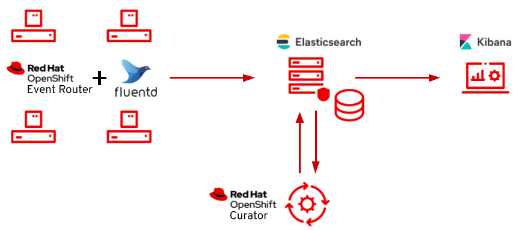

The observability is composed for the following topics:

* **Monitoring:**  is the capacity to know how many resources are consuming the applications, response times, etc.
* **Logging**: We need to know what is happening in our applications. It's essential to have the capacity to visualize it as functional pieces, as they could be distributed between many applications or application instances.
* **Traceability:** is the ability to follow a request and know the different services by which it enters in order. Additionally, some util information could be saved as response time per service, logging, etc. 

In this repository, we will see how to configure the OpenShift logging stack which is composite for the following Open Source tools:



# Install the operators

GitOps isn't mandatory, but it is a good way to facilitate how we can work with the cluster components and applications. 

## OpenShift Elasticsearch Operator

Firstly, apply the "OpenShift Elasticsearch Operator". This operator installs Elasticseach, which is the database application for logs.

It's essential to select a stable channel, in this case, I've chosen the ```stable-5.6``` channel. 

```bash
oc apply -f gitops/operators/elasticsearch.yaml
```

Once the operator has been installed, you can label the namespace with ```openshift.io/cluster-monitoring: "true"``` to ensure this namespace will be monitored. 

```bash
oc label namespace openshift-operators-redhat openshift.io/cluster-monitoring="true"
```

## Red Hat OpenShift Logging Operator

This operator is responsible for picking up the logs from every pod standard output. Fluentd gets pod logs and sends them wherever we want, by default to Elasticsearch. 

Also, you can do some important actions like log forwarding, reformat the structure, etc. 

### Installation

The process to install the "Red Hat OpenShift Logging Operator" is very similar that the previous operator. 

In this case, we will choose the ```stable-5.6``` channel too. 

```bash
oc apply -f gitops/operators/cluster-logging.yaml
```

Now, we will label the namespace: 

```bash
oc label namespace openshift-operators-redhat openshift.io/cluster-monitoring="true"
```

### Create ClusterLogging instance

By default, the Operator doesn't do anything. We have to create a ```ClusterLogging instance``` with the definition of the different pieces:

```bash
kind: ClusterLogging
apiVersion: logging.openshift.io/v1
metadata:
  name: instance
  namespace: openshift-logging
spec:
  collection:
    type: fluentd
  logStore:
    elasticsearch:
      nodeCount: 3
      redundancyPolicy: SingleRedundancy
      resources:
        requests:
          memory: 2Gi
      storage:
        size: 200G
        storageClassName: gp2
    retentionPolicy:
      application:
        maxAge: 7d
    type: elasticsearch
  managementState: Managed
  visualization:
    kibana:
      replicas: 1
    type: kibana
```

The previous file shows a basic configuration with the Fluentd, Elasticsearch and Kibana configurations, but you will be able to change some parameters like retention, resources, etc.

We apply it:

```bash
oc apply -f gitops/cluster-logging.yaml -n openshift-logging
```

Also, the operator creates some deployments: 

```bash
oc get deployment -n openshift-logging
NAME                           READY   UP-TO-DATE   AVAILABLE   AGE
cluster-logging-operator       1/1     1            1           16h
elasticsearch-cdm-s9t8jos8-1   1/1     1            1           16h
elasticsearch-cdm-s9t8jos8-2   1/1     1            1           16h
elasticsearch-cdm-s9t8jos8-3   1/1     1            1           16h
kibana                         1/1     1            1           16h
```

# Visualize the logs

After the operator is configured, we can visualize the different logs. 

Kibana is the application used to visualize it. The following command gets the Kibana URL:

```bash
oc get route -A | grep kibana | awk '{print $3}' 
```

Now, we can put it on our favourite web browser and log in with our OpenShift credentials.

At this point, you will visualize all the logs that the different pods throw in namespaces labeled with ```openshift.io/cluster-monitoring="true"```

# References

* https://docs.openshift.com/container-platform/4.11/logging/cluster-logging-deploying.html